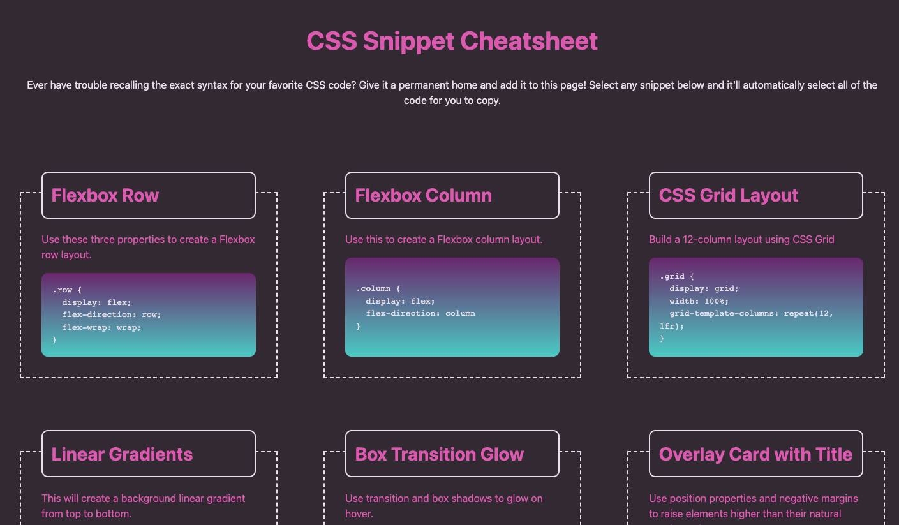

# css-snippet-cheatsheet

* css-snippet-cheatsheet is a resource site, where users can click directly on a code snippet to highlight the code for quick and easy copy-and-paste. GA Tech Coding Bootcamp mini-project.

* See page at https://caitlinw29.github.io/css-snippet-cheatsheet/

